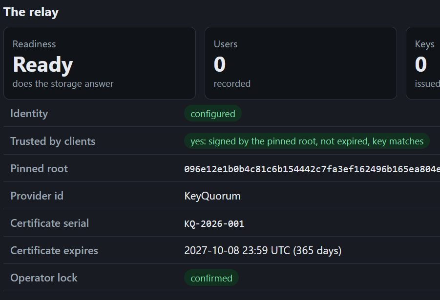

# Admin preview investigation (#110)

Research date: 2026-10-08. This is a candidate implementation, not a deployed
or verified Cloudflare preview. Keep #110 open until the live checks below pass.

## Why the existing link cannot show the console

The bot links to a Preview of `keyquorum-relay`. Production routes send
`/relay/admin/*` to a different Worker. Those zone routes do not follow the
relay into its Preview. Enabling previews in `admin/wrangler.toml` is unsafe:
that configuration binds the production relay's Durable Object.

Cloudflare documents automatic isolation for a Durable Object class defined in
the same Worker without `script_name`. Its documentation does not establish
the required cross-Worker binding to a matching Preview. Do not assume that
two separately built Previews share an isolated namespace.

## Candidate: a dedicated console preview project

`workers/preview/wrangler.json` names `keyquorum-console-preview`, separate
from both production and staging. The preview entrypoint composes the existing
relay and admin handlers, exporting the existing RelayObject in the same Worker.
Only one local RELAY binding exists. The admin handler receives that same
binding as RELAY_ADMIN; it does not accept an external admin binding.

The preview root redirects to `/relay/admin/`; `/relay/` serves its matching
relay. Production entrypoints and the existing public relay Preview remain
unchanged. This deliberately shares an origin **inside this disposable preview**.
The entire dedicated project's previews must be protected by Access. The
existing public relay Preview remains available separately for anonymous review.

No R2 bucket, service binding, production identity, operator lock or other
production resource is configured. The empty Preview will show the setup guide;
it is not expected to report production's configured identity. Do not upload
real credentials to PR code. Both assets and APIs retain the existing JWT
verification, Origin checks, security headers and operator-lock checks.

The top-level configuration has no RELAY binding or enabled CONSOLE_PREVIEW
variable, so an accidental normal deployment of this dedicated configuration
serves 503. Static assets use run_worker_first. Production admin previews stay off.

## Cloudflare setup (owner approval required before resource creation)

1. Create the dedicated project `keyquorum-console-preview` and connect this
   repository with root directory `workers`. Do not repoint either production
   Worker's build configuration. Configure only trusted same-repository branches;
   do not provide production deploy credentials to fork or other untrusted builds.
2. Protect **all preview traffic** for this project with Cloudflare Access before
   enabling branch previews. Use the existing authorized operator identities and
   security-key MFA requirements. Use a separate Access application/audience from
   production. Verify the policy in the dashboard; the code does not configure it.
3. Put that application's public team domain and audience in this dedicated
   configuration's `previews.vars.ACCESS_TEAM_DOMAIN` and `ACCESS_AUD`. Empty
   values deliberately leave it unavailable. These are not secrets. Confirm the
   rate-limit namespaces 4901–4903 are unused in this account before provisioning.
4. Set build command `npm run builds:console`, production branch command
   `npm run check:console-preview` (dry run only), and non-production command
   `npm run preview:console`. Keep Node 22 as in the existing project.
5. Cloudflare's GitHub integration posts a Preview URL for builds running
   `wrangler preview`; the separate project should add its own bot result. Its
   root opens the console. Confirm the displayed commit and immutable deployment
   URL correspond to the PR head, rather than an older successful build.

The production Access application and production secrets must not be changed.
Creating this project, applying Access, building and authenticating remain live
acceptance work; this PR does not claim that they have happened.

## Live acceptance and cleanup

- Test both `/relay/admin` and `/relay/admin/`, sign-in return, HTML, JS, CSS,
  console WASM and GET `/relay/admin/api/overview` as an authorized operator.
- Test anonymous denial and missing/forged/expired/wrong-audience tokens. Verify
  Access covers branch and immutable deployment URLs; no alternate URL may
  expose assets or data. Never disable JWT verification to make the preview load.
- Inspect the deployed RELAY binding and actual namespace. Record the PR, SHA,
  Preview identity and namespace; verify it differs from production, staging,
  and another PR. Check a synthetic write stays isolated and still requires
  Origin, lock and idempotency checks. Never copy production data for this test.
- Confirm both the separate public relay bot link and the protected console bot
  link work. The protected console includes its own matching `/relay/` endpoint.
- On PR closure, delete only the matching dedicated project's Preview after
  checking its name in the dashboard. Cloudflare documents namespace deletion
  with Preview deletion. Do not delete the project or any production/staging
  Worker. Verify cleanup; automatic PR-close cleanup has not been established.

Local tests cover routing, fail-closed behavior, retained authorization gates,
and local namespace selection with a stub. They do not prove Cloudflare's
deployed namespace, Access policy, billing limits, bot output or cleanup.

## Sources

- [Preview resources and isolation](https://developers.cloudflare.com/workers/previews/resources/)
- [Preview configuration](https://developers.cloudflare.com/workers/previews/configuration/)
- [Access protection for Workers and previews](https://developers.cloudflare.com/workers/configuration/cloudflare-access/)
- [GitHub bot preview comments](https://developers.cloudflare.com/workers/ci-cd/builds/git-integration/github-integration/)

## Production evidence for #102 and #104

The owner supplied this cropped production Status screenshot on 2026-10-08.
It shows Ready, configured identity, trusted certificate/key, provider KeyQuorum,
serial KQ-2026-001, expiry 2027-10-08 23:59 UTC, and confirmed operator lock.
It contains no private credential or lock value. The full public root was also
compared in the authenticated console with the owner's expected root.

[Production run 37824399333, attempt 2](https://github.com/BPForbes/KeyQuorum/actions/runs/37824399333)
succeeded after private R2 bucket creation. The owner subsequently uploaded both
identity secrets to keyquorum-relay using Wrangler OAuth and confirmed the lock.
This evidence establishes production setup; it does not demonstrate customer
enrollment, package installation, rotation, recovery or a first issuance.
